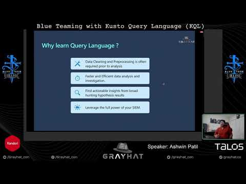
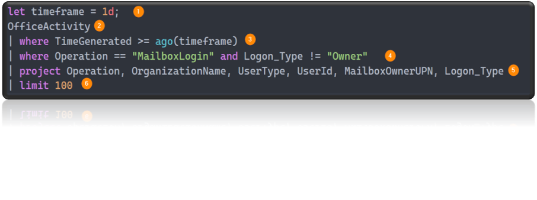
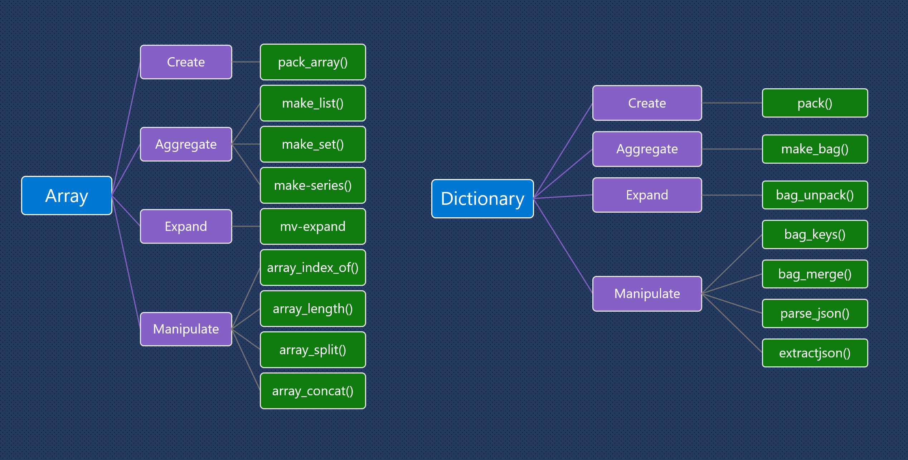

# blue-teaming-with-kql
Repository with Sample KQL Query examples for Threat Hunting

This folder has various KQL examples related to Threat Hunting/Blue Teaming presented at [Blue Team Village at GrayHat 2020](https://grayhat.co/event/blue-teaming-with-kusto-query-language-kql/).

## Presentation:

[GrayHat-BlueTeamingwithKQL](https://github.com/ashwin-patil/blue-teaming-with-kql/blob/main/GrayHat-%20BlueTeamingwithKQL.pdf)

## Talk Recorded Video
[](https://www.youtube.com/watch?v=IMZkqTEBFeA)


 **Jupyter Notebook** : 
 
 Click on nbviewer Badge :: [](https://nbviewer.jupyter.org/github/microsoft/msticpy/blob/master/docs/notebooks/Data_Queries.ipynb)


- [Structure of Basic KQL Query](#structure-of-basic-kql-query)
- [KQL Basic Searches](#kql-basic-searches)
- [Exploring Tables and Schemas](#explore-tables-schemas)
- [Asset/Device Details](#asset-details)
- [Query Parameterization](#query-parameterization)
- [Dynamic DataTypes](#dynamic-datatypes)
- [Datetime](#datetime)
- [Regex Extraction](#regex-extraction)
- [Functions](#functions)
    - [User Defined](#user-defined)
    - [Built-in Functions](#built-in-functions)
- [Time Series Analysis](#time-series-analysis)
- [Network Beaconing](#network-beaconing)
- [KQL Programmatic Interfaces](#kql-programmatic-interfaces)
    - [QueryProvider Demo](#queryprovider-demo)
 - [KQL Gallery](#kql-gallery)

## Structure of Basic KQL Query
1. Variable Declaration
2. Table Name
3. Datetime Filtering
4. Event Type Filtering
5. Output Formatting/ Display selected Fields
6. Limit Results



## KQL Basic Searches
### Search for presence of keyword and output tables where it is present

```python
  search "badaccount" 
  | where TimeGenerated > ago(4h) 
  | summarize count() by $tableName
```

### Search for IP in multiple tables - irrespective of field names
```python
  search "8.8.8.8" in ("AzureNetworkAnalytics_CL", "CommonSecurityLog") 
  | where TimeGenerated > ago(1h)
  | limit 100
```

### Sort by time
```python
  AzureActivity 
  | where TimeGenerated > ago(1h) 
  | sort by TimeGenerated desc
```

### Filter by value
```python
  SecurityEvent
  | where TimeGenerated > ago(1h)
  | where EventID == 4688
  | limit 100
```

### Aggregation by Field name
```python
  OfficeActivity
  | where TimeGenerated > ago(1h)
  | summarize count() by OperationName
```

## Exploring Tables and Schemas

### DataTypes ingested along with the Sizes
```python
  Usage
  | where TimeGenerated > ago(1d)
  | summarize DataSizeinMB = sum(Quantity) by DataType
  | sort by DataSizeinMB desc 
```

### Schema and datatypes for each field of Table
```python
  AzureActivity
  | getschema 
```

### Tables across Workspace Queries
```python
  union workspace('WorkSpace01').Heartbeat, workspace('WorkSpace02').Heartbeat
  | where TimeGenerated > ago(1d)
  | where Computer == "CH-UBNTVM"
  | limit 100
```

## Asset/Device Details
### Asset Details
```python
  Heartbeat
  | where ComputerIP == "40.71.227.249"
  | summarize LastReported = max(TimeGenerated) by Computer, ComputerIP, RemoteIPCountry, 
  ComputerEnvironment, OSType, OSMajorVersion, OSMinorVersion, SubscriptionId, TenantId
```

### Microsoft 365 Defender - Device Information
```python
  DeviceInfo
  | where DeviceName == "contosohost" and isnotempty(OSPlatform)
  | project TenantId, DeviceName, PublicIP, IsAzureADJoined, OSPlatform, OSBuild, OSArchitecture, LoggedOnUsers
```

### Microsoft 365 Defender - Hostname based on Private IP addresses
```python
  DeviceNetworkInfo
  | mv-expand IPAddresses
  | extend IPAddress = tostring(parse_json(IPAddresses).IPAddress)
  | where IPAddress== '10.0.0.100' 
  | project DeviceName, NetworkAdapterType, TunnelType, MacAddress
```

## Query Parameterization

### Query Parameterization - Dynamic List  - in~ operator 

```python
  let timeframe = 1d;
  let EventNameList = dynamic(["UpdateTrail","DeleteTrail","StopLogging","DeleteFlowLogs","DeleteEventBus"]);
  AWSCloudTrail
  | where TimeGenerated > ago(timeframe)
  | where EventName in~ (EventNameList)
  | limit 100
```

### Query Parameterization - Dynamic list - has_any operator

```python
Expensive Computes
  let timeframe = 1d;
  let tokens = dynamic(["416","208","128","120","96","80","72","64","48","44","40","g5","gs5","g4","gs4","nc12","nc24","nv12"]);
  let operationList = dynamic(["Create or Update Virtual Machine", "Create Deployment"]);
  AzureActivity
  | where TimeGenerated >= ago(timeframe)
  | where OperationName in (operationList)
  | where ActivityStatus == "Accepted" 
  | where isnotempty(Properties)
  | extend vmSize = tolower(tostring(parse_json(tostring(parse_json(tostring(parse_json(tostring
  (parse_json(Properties).responseBody)).properties)).hardwareProfile)).vmSize))
  | where isnotempty(vmSize)
  | where vmSize has_any (tokens) 
  | limit 100
```

### Contains vs has demo
```python
  let CustomLogs = datatable(Username:string)
  [
      "abcadmin123",
      "admin123",
      "admin",
      "samadmin"
  ];
  CustomLogs 
  //| where Username has "admin"
  | where Username contains "admin"
```

## Dynamic DataTypes



## Datetime

### Todatetime demo 
```python
  let CustomLogs = datatable(TimeGenerated:string)
  [
      "2020-10-23 01:00:00",
      "2020-10-24 02:00:00"
  ];
  CustomLogs 
  | extend TimeGenerated1 = todatetime(TimeGenerated)
  | getschema
```

### Datetime conversion demo
```python
  let CustomLogs = datatable(TimeGenerated:string)
  [
      "2020-10-23 01:00:00",
      "2020-10-24 02:00:00"
  ];
  CustomLogs 
  | extend TimeGenerated1 = todatetime(TimeGenerated)
  | extend Day = format_datetime(TimeGenerated1, "yyyy-MM-dd")
```

## Regex Extraction
### Matches regex demo

```python
  let PrivateIPregex = @'^127\.|^10\.|^172\.1[6-9]\.|^172\.2[0-9]\.|^172\.3[0-1]\.|^192\.168\.';
  let endtime = 1d;
  CommonSecurityLog
  | where TimeGenerated >= ago(endtime) 
  | where DeviceVendor =~ "Cisco"
  | where DeviceAction =~ "denied"
  | extend SourceIPType = iff(SourceIP matches regex PrivateIPregex,"private" ,"public" )
  | where SourceIPType == "public"
  | summarize count() by SourceIP
  | join (
    // Successful signins from IPs blocked by the firewall solution are suspect
    // Include fully successful sign-ins, but also ones that failed only at MFA stage
    // as that supposes the password was sucessfully guessed.
      SigninLogs
      | where ResultType in ("0", "50074", "50076") 
      ) on $left.SourceIP == $right.IPAddress
  | limit 100
```

### Extract Key value pair from AdditionalExtension field in CommonSecurityLog

```python
  let CommonSecurityLog = datatable (DeviceVendor: string, AdditionalExtensions: string)
  [
  "ZScaler", "country=United States;sourceAddress=10.10.10.10;sourcehostname=http://abc.ac.com;deviceTranslatedPort=60095;tunnelType=IPSEC;dnat=No;stateful=Yes;reason=Allow DNS;cs6label=threatname;destCountry=Italy;avgduration=143",
  "Fortinet", "FortinetFortiGatelogid=1059028704;cat=utm:app-ctrl;FortinetFortiGatesubtype=app-ctrl;FortinetFortiGateeventtype=signature;FortinetFortiGatevd=root",
  "Palo Alto Networks", "cat=general;PanOSDGl1=0;PanOSDGl2=0;PanOSDGl3=0;PanOSDGl4=0;PanOSVsysName=;PanOSActionFlags=0x0"
  ];
  CommonSecurityLog
  | extend AdditionalExtensions = extract_all(@"(?P<key>\w+)=(?P<value>[a-zA-Z0-9-_:/@. ]+)", dynamic(["key","value"]), AdditionalExtensions)
  | mv-apply AdditionalExtensions on (
  summarize AdditionalExtensionsParsed = make_bag(pack(tostring(AdditionalExtensions[0]), AdditionalExtensions[1]))
  )
```

## Functions

### User Defined
Function Demo - GetAllAlertsOnHost

Source - https://github.com/Azure/Azure-Sentinel/blob/master/Exploration%20Queries/InputEntity_Host/AlertsOnHost.txt

```python
  let GetAllAlertsOnHost = (suspiciousEventTime:datetime, v_Host:string){
  //-3d and +6h as some alerts fire after accumulation of events
  let v_StartTime = suspiciousEventTime-3d;
  let v_EndTime = suspiciousEventTime+6h;
  SecurityAlert
  | where TimeGenerated between (v_StartTime .. v_EndTime)
  // expand JSON properties
  | extend Extprop = parsejson(ExtendedProperties)
  | extend Computer = toupper(tostring(Extprop["Compromised Host"]))
  | where Computer contains v_Host
  | project TimeGenerated, AlertName, Computer, ExtendedProperties
  };
  // change datetime value and hostname value below
  GetAllAlertsOnHost(datetime('2020-10-23T00:00:00.000'), toupper("VICTIM00"))
```

### Built-in Functions

### Parse_path demo
```python
  let SecurityEvent = datatable (EventID: string, ​ShareLocalPath: string)
  [
  "5145",@"\\shared\users\temp\file.txt.gz",
  "5145",@"\\shared\users\temp\bad.exe",
  "5145",@"\\shared\users\temp\script.ps1"
  ];
  SecurityEvent
  | where EventID == 5145
  | extend ShareLocalPathParsed = parse_path(ShareLocalPath)
  | extend extension = tostring(parse_json(ShareLocalPathParsed).Extension),
   FileName = tostring(parse_json(ShareLocalPathParsed).Filename), 
   DirName = tostring(parse_json(ShareLocalPathParsed).DirectoryName)
```

### ip4_is_match with lookup demo
```python
  let lookup = dynamic (["13.66.60.119/32","13.66.143.220/30","13.66.202.14/32"]);
  let AzureSubnetMatchedIPs=materialize(
  CommonSecurityLog
  | where TimeGenerated > ago(4h)
  | mv-apply l=lookup to typeof(string) on
  (
  where ipv4_is_match (DestinationIP, l)
  )
  | project-away l);
  AzureSubnetMatchedIPs
  | limit 100 
```

### Windows XML Parsing of Dynamic Field - EventData
```python
   Event
   | where TimeGenerated > ago(4h)
   | extend EventData = parse_xml(EventData).DataItem.EventData.Data
   | mv-expand bagexpansion=array EventData
   | evaluate bag_unpack(EventData)
   | extend Key=tostring(['@Name']), Value=['#text']
   | evaluate pivot(Key, any(Value), TimeGenerated, EventLog, Computer, EventID)
```

## Externaldata Demo

KQL Blog - [Using External data sources to enrich network logs using Azure storage and KQL](https://techcommunity.microsoft.com/t5/azure-sentinel/using-external-data-sources-to-enrich-network-logs-using-azure/ba-p/1450345)
```python
  let covidIndicators = (externaldata(TimeGenerated:datetime, FileHashValue:string, FileHashType: string )
  [@"https://raw.githubusercontent.com/Azure/Azure-Sentinel/master/Sample%20Data/Feeds/Microsoft.Covid19.Indicators.csv"]
  with (format="csv"));
  covidIndicators
```

### Externaldata - Azure IP ranges feed. 
Link is not static and gets expired as new content arrives

```python
  let AzureIPRangesPublicCloud = (externaldata(changeNumber:string, cloud:string, values: dynamic)
  [@"https://download.microsoft.com/download/7/1/D/71D86715-5596-4529-9B13-DA13A5DE5B63/ServiceTags_Public_20201019.json"] 
  with (format="multijson"));
  let AzureSubnetRangeAllowlist = AzureIPRangesPublicCloud 
  | mv-expand values 
  | extend addressPrefixes = parse_json(parse_json(values).properties).addressPrefixes; 
  AzureSubnetRangeAllowlist
```

## Time Series Analysis
 KQL Blog - [Time Series Analysis and  it`s applications in Security](https://techcommunity.microsoft.com/t5/azure-sentinel/looking-for-unknown-anomalies-what-is-normal-time-series/ba-p/555052)

Time Series Analysis - Process Execution Anomaly
```python
  let starttime = 14d;
  let endtime = 1d;
  let timeframe = 1h;
  let TotalEventsThreshold = 5;
  let ExeList = dynamic(["powershell.exe","cmd.exe","wmic.exe","psexec.exe","cacls.exe","rundll.exe"]);
  let TimeSeriesData = 
  SecurityEvent
  | where EventID == 4688 | extend Process = tolower(Process)
  | where TimeGenerated between (startofday(ago(starttime))..startofday(ago(endtime)))
  | where Process in (ExeList)
  | project TimeGenerated, Computer, AccountType, Account, Process
  | make-series Total=count() on TimeGenerated from ago(starttime) to ago(endtime) step timeframe by Process;
  let TimeSeriesAlerts = TimeSeriesData
  | extend (anomalies, score, baseline) = series_decompose_anomalies(Total, 1.5, -1, 'linefit')
  | mv-expand Total to typeof(double), TimeGenerated to typeof(datetime), anomalies to typeof(double), score to typeof(double), baseline to typeof(long)
  | where anomalies > 0
  | project Process, TimeGenerated, Total, baseline, anomalies, score
  | where Total > TotalEventsThreshold;
  TimeSeriesAlerts
  | join (
  SecurityEvent
  | where EventID == 4688 | extend Process = tolower(Process)
  | summarize CommandlineCount = count() by bin(TimeGenerated, 1h), Process, CommandLine, Computer, Account
  ) on Process, TimeGenerated 
  | project AnomalyHour = TimeGenerated, Computer, Account, Process, CommandLine, CommandlineCount, Total, baseline, anomalies, score 
  | extend timestamp = AnomalyHour, AccountCustomEntity = Account, HostCustomEntity = Computer
```

## Network Beaconing
Reference Work:
- [Threat Hunting Project](https://github.com/ThreatHuntingProject/ThreatHunting/blob/master/hunts/beacon_detection_via_intra_request_time_deltas.md)

- [Flare](http://www.austintaylor.io/detect/beaconing/intrusion/detection/system/command/control/flare/elastic/stack/2017/06/10/detect-beaconing-with-flare-elasticsearch-and-intrusion-detection-systems/) by [Austin Taylor](https://twitter.com/HuntOperator)

 KQL Blog - [Detect Network Beaconing via Intr-Request time delta patterns in Azure Sentinel](https://techcommunity.microsoft.com/t5/azure-sentinel/detect-network-beaconing-via-intra-request-time-delta-patterns/ba-p/779586)

```python
  let starttime = 2d;
  let endtime = 1d;
  let TimeDeltaThreshold = 10;
  let TotalEventsThreshold = 15;
  let PercentBeaconThreshold = 80;
  let PrivateIPregex = @'^127\.|^10\.|^172\.1[6-9]\.|^172\.2[0-9]\.|^172\.3[0-1]\.|^192\.168\.';
  let DestIPList = CommonSecurityLog
  | where DeviceVendor == "Palo Alto Networks" and Activity == "TRAFFIC"
  | where TimeGenerated between (ago(starttime)..ago(endtime))
  | extend DestinationIPType = iff(DestinationIP matches regex PrivateIPregex,"private" ,"public" )
  | where DestinationIPType == "public"
  | summarize dcount(SourceIP) by DestinationIP
  | where dcount_SourceIP < 5
  | distinct DestinationIP;
  CommonSecurityLog
  | where DeviceVendor == "Palo Alto Networks" and Activity == "TRAFFIC"
  | where TimeGenerated between (ago(starttime)..ago(endtime))
  | where DestinationIP in ((DestIPList))
  | project TimeGenerated, DeviceName, SourceUserID, SourceIP, SourcePort, DestinationIP, DestinationPort, ReceivedBytes, SentBytes
  | sort by SourceIP asc,TimeGenerated asc, DestinationIP asc, DestinationPort asc
  | serialize
  | extend nextTimeGenerated = next(TimeGenerated, 1), nextSourceIP = next(SourceIP, 1)
  | extend TimeDeltainSeconds = datetime_diff('second',nextTimeGenerated,TimeGenerated)
  | where SourceIP == nextSourceIP
  //Whitelisting criteria/ threshold criteria
  | where TimeDeltainSeconds > TimeDeltaThreshold 
  | project TimeGenerated, TimeDeltainSeconds, DeviceName, SourceUserID, SourceIP, SourcePort, DestinationIP, DestinationPort, ReceivedBytes, SentBytes
  | summarize count(), sum(ReceivedBytes), sum(SentBytes), make_list(TimeDeltainSeconds) 
  by TimeDeltainSeconds, bin(TimeGenerated, 1h), DeviceName, SourceUserID, SourceIP, DestinationIP, DestinationPort
  | summarize (MostFrequentTimeDeltaCount, MostFrequentTimeDeltainSeconds) = arg_max(count_, TimeDeltainSeconds), TotalEvents=sum(count_), TotalSentBytes = sum(sum_SentBytes), TotalReceivedBytes = sum(sum_ReceivedBytes) 
  by bin(TimeGenerated, 1h), DeviceName, SourceUserID, SourceIP, DestinationIP, DestinationPort
  | where TotalEvents > TotalEventsThreshold 
  | extend BeaconPercent = MostFrequentTimeDeltaCount/toreal(TotalEvents) * 100
  | where BeaconPercent > PercentBeaconThreshold
  | extend timestamp = TimeGenerated, IPCustomEntity = DestinationIP, AccountCustomEntity = SourceUserID, HostCustomEntity = DeviceName

```

## KQL Programmatic Interfaces
- [msticpy]()
    - [list of Data queries](https://msticpy.readthedocs.io/en/latest/data_acquisition/DataQueries.html)
    - List Pre-defined Queries :[list_queries()](https://msticpy.readthedocs.io/en/latest/data_acquisition/DataProviders.html#listing-available-queries)
    - Execute a Query 
        - [Running pre-defined query](https://msticpy.readthedocs.io/en/latest/data_acquisition/DataProviders.html#running-an-pre-defined-query) 
        - Running Ad-Hoc Query: [exec_query()](https://msticpy.readthedocs.io/en/latest/data_acquisition/DataProviders.html#running-an-ad-hoc-query)
    - Import from query file : [import_query_file()](https://msticpy.readthedocs.io/en/latest/data_acquisition/DataProviders.html#adding-a-new-set-of-queries-and-running-them)
    - [Splitting Query Execution into Chunks](https://msticpy.readthedocs.io/en/latest/data_acquisition/DataProviders.html#splitting-query-execution-into-chunks)

### QueryProvider Demo


## KQL Gallery

> Curated list of KQL queries worth highlighting


One-stop KQL query for most regex (IP, URL, API Access tokens, Crypto Wallets) needs. 
<br>Regex Credits - [bee-san/PyWhat Github](https://github.com/bee-san/pyWhat) 

```python
let pywhatregex = (externaldata(Name:string, Regex:string, plural_name: string, Description: string, Rarity:string, URL: string, Tags: dynamic )
[@"https://raw.githubusercontent.com/bee-san/pyWhat/main/pywhat/Data/regex.json"] with (format="multijson"));
pywhatregex
```
subquery to select a specific regex
```python
let pywhatregex = (externaldata(Name:string, Regex:string, plural_name: string, Description: string, Rarity:string, URL: string, Tags: dynamic )
[@"https://raw.githubusercontent.com/bee-san/pyWhat/main/pywhat/Data/regex.json"] with (format="multijson"));
let githubaccesstokenregex = pywhatregex | where Name == "GitHub Access Token" | project Regex;
githubaccesstokenregex
```